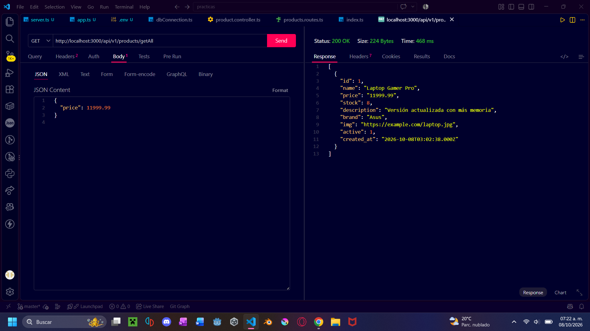
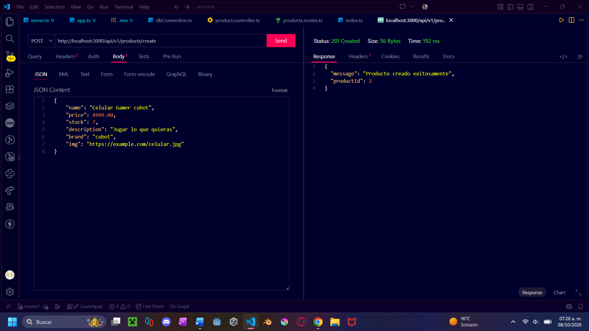
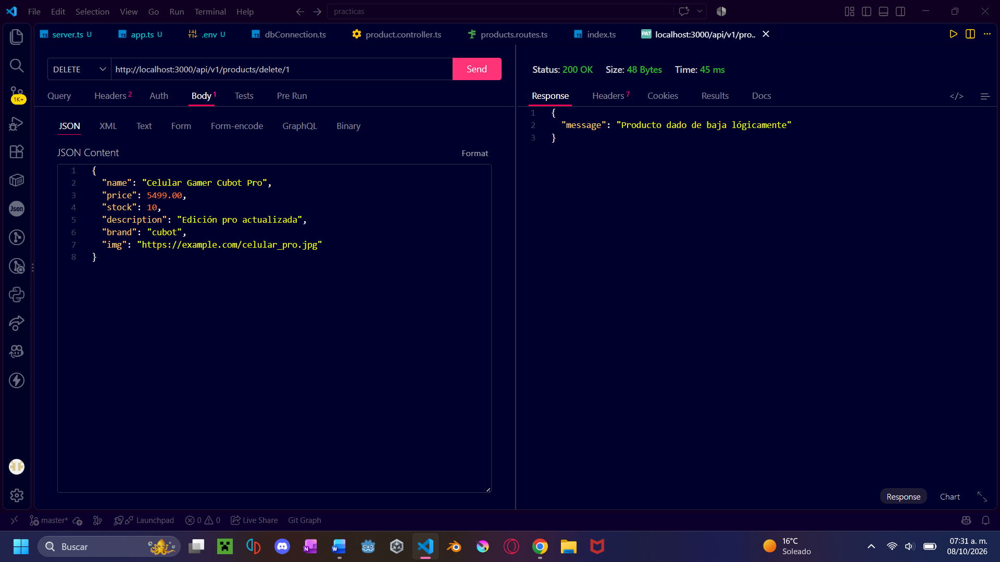
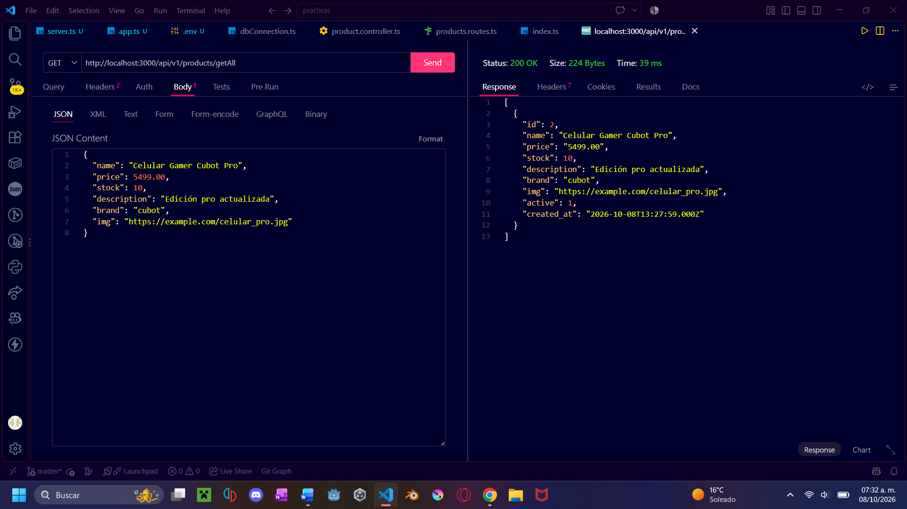
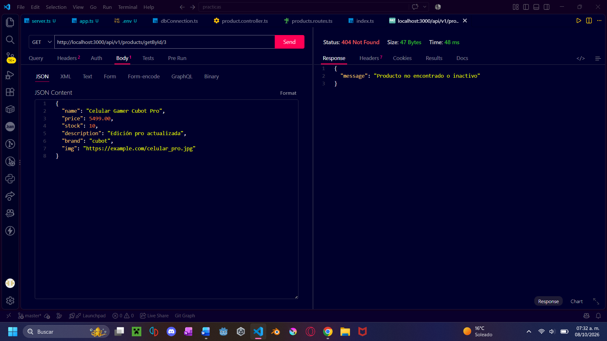
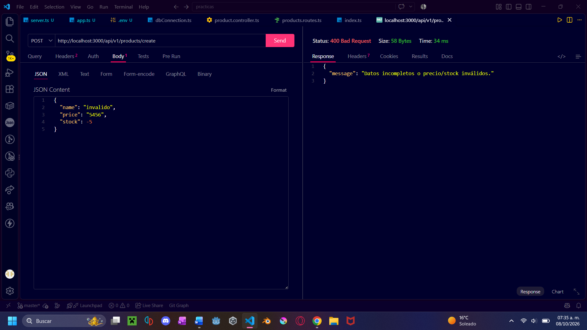

##Evidencia de la tarea con Thunder Client##

1.	Consulta General Y Consulta Por ID De Un Producto Activo;
 

2.	Creación De Un Producto;

3.	Actualización Completa Y Cambio De Precio Del Producto Creado;
 

4.	Baja Lógica Del Producto;
 

5.	Comprobación De Que El Producto Dado De Baja Ya No Aparece En Getall Ni En Getbyid/:Id;
 

6.	Un Caso De ID Inexistente Y Un Caso De Datos Inválidos.
 
 
 
